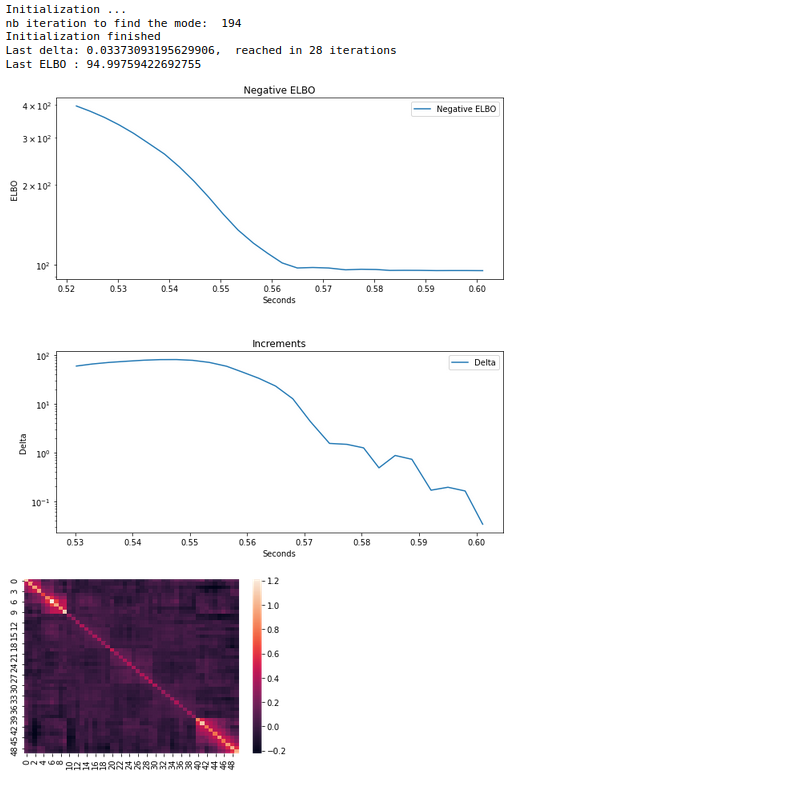
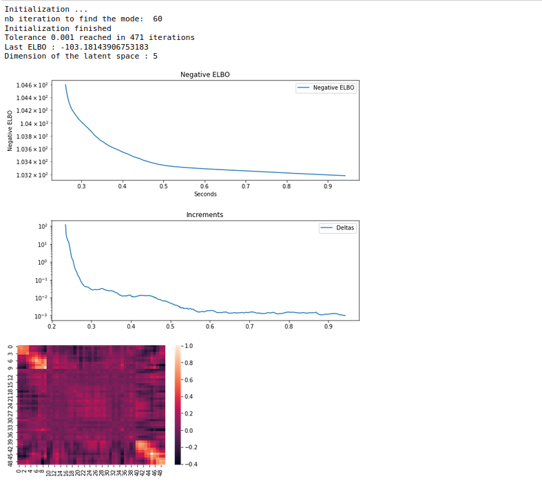
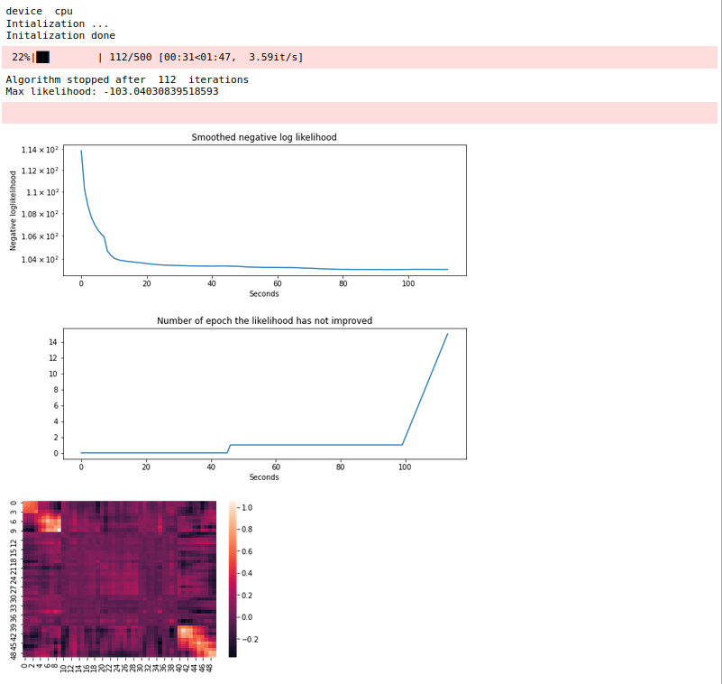

# Usage and main fitting functions

### Description of the package

The package implements 3 differents classes that fits a PLN-PCA model (described in the mathematical description above). Basically, it tries to find the correlation between features and the effect of covariables on these features. As main characteristic, this model takes into account count data. 
- The fastPLN class fits a PLN model (a special PLN-PCA model) using variational approximation. 
- The fastPLNPCA class fits a PLN-PCA  using variational approximation. 
- The IMPS_PLN fits a PLN-PCA model using Importance sampling. 

IMPS_PLN is always slower than fastPLN. fastPLNPCA is faster than fastPLN only for datasets with very large number of genes (p>5000, see [here](https://github.com/PLN-team/PLNpy/blob/master/images/Comparison_fastPLN_vs_fastPLNPCA_n%3D1000.png)). However, 
fastPLNPCA is convenient since it allows to get the Principal Components (PCs) directly, in contrary to fastPLN. To get the PCs using fastPLN, you first need to fit the model and do a PCA on the matrix $\Sigma$  found. The numerical complexity is always linear with respect to the number of samples n (see [here](https://github.com/PLN-team/PLNpy/blob/master/images/Comparison_fastPLN_vs_fastPLNPCA_p%3D1000.png)) 


All of these class are aggregated into the class PLNmodel, so that you don't need to deal with multiple classes. This class will automatically fit the data with one of those classes.  

### How to use the package? 

First, you need to pip install the package. We recommend to create a new environment before installing the package.  

```
pip install pyPLNmodels
```

The package comes with an artificial dataset to present the functionality. You can load it doing the following: 

```
import pandas as pd
Y = pd.read_csv('example_data/Y_test')
O = pd.read_csv('example_data/O_test')
cov = pd.read_csv('example_data/cov_test')
```

If you want $q$ Principal Composants, you only need to call: 

```
from pyPLNmodels.models import PLNmodel
nbpcs = 5 # number of principal components 
mypln = PLNmodel(q= nbpcs)
mypln.fit(Y,O,cov)
print(mypln)
```

Note that if you do not specify $q$, it will take the maximum possible value. You can look for a better approximation by setting ```fast = False ``` in the ```.fit()``` method, but it will take much more time:

```
nbpcs = 5 
mypln = PLNmodel(nbpcs)
mypln.fit(Y,O,cov, fast = False)
print(mypln)
```


###### How to get the model parameters back ? 

You can get the model parameters back running: 

```
beta = mypln.get_beta()
C = mypln.get_C()
Sigma = mypln.get_Sigma()
```


<strong>This class automatically picks the right model among ```fastPLN, fastPLNPCA``` and  ```IMPS_PLN```. If you want to know more about each of these algorithms that are quite different, you can check below.</strong> 

### How to fit each model? 

#### Fit the PLN model

 
You have to call : 

```
from pyPLNmodels.models import fastPLN
fast = fastPLN()
fast.fit(Y,O,cov)
print(fast)
```



##### Hyperparameters

Here are the main hyperparameters of the ```.fit()``` method of the ```fastPLN``` object:
- ```N_iter_max```: The maximum number of iteration you are ready to do. If the algorithm has not converged, you can try to increase it. Default is 200. 
- ```tol```: tolerance of the model. The algorithm will stop if the ELBO (approximated likelihood of the model) has not increased of more than ```tol```. Try to decrease it if the algorithm has not converged. Default is ```1e-1```
- ```good_init```: If set to ```True```, the algorithm will do an initialization that can take some time, especially for large datasets. You can set it to ```False``` if you want a much faster but random initialization. Default is ```True```. 

Those 3 parameters are important. However, they won't change the asymptotic behavior of the algorithm. If you launch the algorithm for a sufficient time (i.e. ```tol``` is small enough and ```N_iter_max``` is big enough), it will converge to the right parameters independently of the hyperparameters. Moreover, the default arguments are convenient for most datasets. 
If you want to see the progress of the algorithm in real time, you can set ```Verbose = True``` in the .```fit()``` method. 

##### How to be sure the algorithm has converged ?

Basically, if the ELBO reaches a plateau, the algorithm has converged. If it has not reached a plateau, then you can try to increase the number of iteration ```N_iter_max``` or lower the tolerance ```tol```. 

Note that you don't need to restart the algorithm from the beginning, you can start from where the algorithm has stopped by calling: 

```
fast.fit(Y,O,cov, N_iter_max = 500, tol = 1e-5)
```
The numerical complexity is quadratic with respect to the number of genes p.

### Fit the fastPLNPCA model

To fit the ```fastPLNPCA``` object, you first need to declare the number of PCs you want, and then you can fit the object:

```
from pyPLNmodels.models import fastPLNPCA
nbpcs = 5
fastpca = fastPLNPCA(q=nbpcs)
fastpca.fit(Y,O,cov)
print(fastpca)
```




The hyperparameters of the ```.fit()``` method are the same as for the ```fastPLN``` object. Only the Default values  of ```N_iter_max ``` and ```tol``` are differents: 

- ```N_iter_max ``` default is : 5000
- ```tol  ``` default is : 1e-3

You can check if the algorithm has converged following the same guidelines as for ```fastPLN```. 
The numerical complexity is linear with respect to the number of genes p.

### Fit the IMPS_PLN model


To fit the IMPS based model, you need to declare the number of Principal composents, and then you can fit the model:  
```
from pyPLNmodels.models import IMPS_PLN
nbpcs = 5
imps = IMPS_PLN(nbpcs)
imps.fit(Y,O,cov)
print(imps)
```




##### Hyperparameters

The hyperparameters of the ```.fit()``` method of the ```IMPS_PLN``` are more complicated and technical. We suggest to take a look at the mathematical description of the package to gain intuition. Basically, the ```IMPS_PLN``` estimates the gradients of the log likelihood with importance sampling. Here are the main  hyperparameters and their impacts: 
- ```acc```: the accuracy of the approximation. The lower the better the gradient approximation, but the lower the algorithm. Default is 0.005 You can try to increasing it if you want to be faster. However reducing it won't gain much accuracy, and will significantly increase the convergence time. 
- ``` N_epoch_max```: The maximum number of iteration you are ready to do. If the tolerance has not converged, you can try to increase it. Default is 500. 
- ```lr```: Learning rate of the gradient ascent. You can try to reduce it or lower it, and see if the final likelihood has improved. Default is 0.1. 
- ```batch_size```: The batch size of the gradient descent. The larger the more accurate the gradients, but the slower the algorithm. if you have very large datasets, you can try to increase it. If you decrease it, then you hsould also decrease the learning rate. Default is 40. Should not exceed the number of samples you have in your dataset. 
- ```optimizer```: The optimizer you take for the gradient ascent. You can try ```torch.optim.RMSprop```, which is more robust to inappropriate learning rates. However lower the learning rate to 0.01 if using ```torch.optim.RMSprop```. Default is ```torch.optim.Adagrad```. 
- ```nb_plateau```: The algorithm will stop if the likelihood of the model has not increased during ```nb_plateau``` epochs. Default is 15. 
- ```nb_trigger```: Since the likelihood is approximated and random, we consider that the likelihood does not increase if during ```nb_trigger``` iterations it has not improved from the maximum likelihood computed. This parameter is here to deal with the randomness of the criterion.   Default is 5. 
- ```good_init```: If set to ```True```, the algorithm will do a precise initialization (that takes some time). You can remove this step by setting ```good_init = False ```. Default is True. 

You can see the progress of the algorithm in real time by setting ```verbose = True``` in the ```.fit()``` method. 
The numerical complexity is linear with respect to the number of genes p.

##### How to be sure the algorithm has converged ? 

Unfortunately, there is no heuristics to know if the algorithm has converged. Indeed, even if you reach a plateau, it is possible that you can reach a much better plateau with other hyperparameters. However, this is in fact due to the choice of ```torch.optim.Adagrad``` as optimizer. If it has converged, it will be a very good solution. To have a (fast) convergence, you need to take the learning rate in the right interval. Fortunately, it is quite large: about ```[0.01, 0.3]``` for many cases. 

If you have still not converged, you can try to change the optimizer to ```torch.optim.RMSprop```, but lower the learning to 0.02 or lower. You can also increase the batch_size and the number of iteration you do. If your dataset is not too big, as a last resort, you can try to set the learning rate to 0.1, taking as optimizer ```torch.optim.Rprop``` and set the ```batch_size``` to the number of samples you have in your dataset. 


### How to retrieve the parameters of the model ? 

After fitting the model, one can retrieve the parameters of the model. To retrieve $\beta$, you only need to call:

```beta_chap = model.get_beta() ```

To retrieve $\Sigma$, you only need to call: 

```Sigma_chap = model.get_Sigma()```

Note that for the PCA models, this matrix won't be invertible. 

To retrieve $C$, you only need to call: 

```C_chap = model.get_C()```

For the fastPLN object, you will get a Matrix of size $(p,p)$ containing the eigenvectors of $\Sigma$ numberred progressively from the eigenvectors with largest eigenvalue to the lowest. 


## Quick mathematical description of the package. 

The package tries to infer the parameters of two models: 

- Poisson Log Normal-Principal Composent Analysis model (PLN-PCA)
- Poisson Log Normal model (PLN) (special case of PLN-PCA model)


We consider the following model PLN-PCA model:  

- Consider $n$ samples $(i=1 \ldots n)$

- Measure $x_{i}=\left(x_{i h}\right)_{1 \leq h \leq d}$ :
$x_{i h}=$ (covariate) for sample $i$ (altitude, temperature, categorical covariate, ...)

- Consider $p$ features (genes) $(j=1 \ldots p)$ Measure $Y=\left(Y_{i j}\right)_{1 \leq i \leq n, 1 \leq j \leq p}$ :

- Measure $Y = Y_{i j}=$ number of times the feature $j$ is observed in sample $i$. 

- Associate a random vector $Z_{i}$ with each sample.
- Assume that the unknown $\left(W_{i}\right)_{1 \leq i \leq n}$ are independant and living in a space of dimension $q\leq p$  such that:

$$
\begin{aligned} 
W_{i} & \sim \mathcal{N}_p\left(0, I_{q}\right)  \\
Z_{i} &=\beta^{\top}\mathbf{x}_{i} +\mathbf{C}W_i  \in \mathbb R^p \\
Y_{i j} \mid Z_{i j} & \sim \mathcal{P}\left(\exp \left(o_{ij} + Z_{i j}\right)\right)
\end{aligned}
$$

and $C\in \mathbb R^{p\times q}$, $\beta \in \mathbb R^{d\times p}$. 

Where $O = (o_{ij})_{1\leq i\leq n, 1\leq j\leq p}$ are known offsets. 

We can see that 

$$Z_{i} \sim \mathcal N_p (\beta^{\top}\mathbf{x}_{i}, \Sigma) $$

The unknown parameter is $\theta = (\Sigma,\beta)$. The latent variable of the model can be seen as $Z$ or $W$. 


- When $p=q$, we call this model Poisson-Log Normal (PLN) model. In this case, $Z_i$ is a non-degenerate gaussian with mean  $\beta^{\top}\mathbf{x}_{i} \in \mathbb R^p$ and covariance matrix $\Sigma$.  
- When $p<q$, we call this model  Poisson-Log Normal-Principal Component Analysis (PLN-PCA). Indeed, we are doing a PCA in the latent layer, estimating $\Sigma$ with a ranq $q$ matrix: $CC^{\top}$.

The goal of this package is to retrieve $\theta$ from the observed data $(Y, O, X)$. To do so, we will try to maximize the log likelihood of the model:
$$p_{\theta}(Y_i)  = \int_{\mathbb R^q} p_{\theta}(Y_i,W)dW \overset{\text{ (if } p=q\text{)}}{=} \int_{\mathbb R^p} p_{\theta}(Y_i,Z)dZ$$

However, almost any integrals involving the law of the complete data is unreachable, so that we can't perform neither gradient ascent algorithms nor EM algorithm.   
We adopt two different approaches to circumvent this problem: 
- Variational approximation of the latent layer (Variational EM)
- Importance sampling based algorithm, using a gradient ascent method.


## Variational approach

We want here to use the EM algorithm, but the E step is unreachable, since the law $Z|Y_i$ (resp $W|Y_i$) is unknown and can't be integrated out. We thus choose to approximate the law of $Z|Y_i$ (resp $W|Y_i$) with a law $\phi_i(Z)$ (resp $\phi_i(W)$), where $\phi_i$ is taken among a family of law. We thus change the objective function: 

$$\begin{align} J_Y(\theta,\phi) & = \frac 1 n \sum _{i = 1}^n J_{Y_i}(\theta, \phi_i) \\ 
J_{Y_i}(\theta, \phi_i)& =\log p_{\theta}(Y_i)-K L\left[\phi_i(Z_i) \|p_{\theta}(Z_i \mid Y_i)\right]\\ 
& = \mathbb{E}_{\phi_i}\left[\log p_{\theta}(Y_i, Z_i)\right] \underbrace{-\mathbb{E}_{\phi_i}[\log \phi_i(Z_i)]}_{\text {entropy } \mathcal{H}(\phi_i)} \\
\end{align}$$


We choose $\phi_i$ in a family distribution : 

$$
\phi_i \in \mathcal{Q}_{\text {diag}}=\{
 \mathcal{N}\left(M_{i}, \operatorname{diag} (S_{i}\odot S_i ))
, M_i \in \mathbb{M} ^q, S_i \in \mathbb{R} ^q\right\}
$$

We choose such a Gaussian approximation since $W$ is gaussian, so that $W|Y_i$ may be well approximated. However, taking a diagonal matrix as covariance breaks the dependecy induced by $Y_i$. 

We can prove that $J_{Y_i}(\theta, \phi_i) \leq p_{\theta} (Y_i) \; \forall \phi_i$. The quantity $J_{Y}(\theta, \phi)$ is called the ELBO (Evidence Lower BOund).  

#### Variational EM 

Given an intialisation $(\theta^0, q^0)$, the variational EM aims at maximizing the ELBO alternating between two steps: 

-  VE step: update  $q$
$$
q^{t+1}=\underset{q \in \mathcal{Q}_{gauss}}{\arg \max } J_Y(\theta^{t}, q)
$$
- M step : update $\theta$
$$
\theta^{t+1}=\underset{\theta}{\arg \max } J_Y(\theta, q^{t+1})
$$
Each step is an optimisation problem that needs to be solved using analytical forms or gradient ascent. Note that $q$ is completely determined by $M = (M_i)_{1 \leq i \leq n } \in \mathbb R ^{n\times q}$ and $S = (S_i)_{1 \leq i \leq n } \in \mathbb R ^{n\times q}$, so that $J$ is a function of $(M, S, \beta, \Sigma)$. $q = (M,S)$ are the variational parameters, $\theta = (\beta, \Sigma$) are the model parameters.  


##### Case $p = q$
The case $p=q$ does not perform dimension reduction, but is very fast to compute. 
Indeed, computations show that the M-step is straightforward in this case as we can update $\Sigma$ and $\beta$ with an analytical form : 

$$
\begin{aligned}
\Sigma^{(t+1)} & = \frac{1}{n} \sum_{i}\left(\left((M^{(t)}-X\beta)_{i} (M^{(t)}-X\beta)_{i}\right)^{\top}+S^{(t)}_{i}\right)\\
\beta^{(t+1)} &= (X^{\top}X)^{-1}X^{\top}M^{(t)} \\ 
\end{aligned}
$$
This results in a fast algorithm, since we only need to go a gradient ascent on the variational parameters $M$ and $S$. Practice shows that we only need to do one gradient step of $M$ and $S$, update $\beta$ and $\Sigma$ with their closed form, then re-perform a gradient step on $M$ and $S$ and so on.


##### Case $p <q$

When $p<q$, we do not have any analytical form and are forced to perform gradient ascent on all the parameters.  Practice shows that we can perform a gradient ascent on all the parameters at a time (doing each VE step and M step perfectly is quite inefficient). 


## Importance sampling based algorithm 

In this section, we try to estimate the gradients with respect to $\theta = (C, \beta) $. 

One can use importance sampling to estimate the likelihood: 

 $$p_{\theta}(Y_i) = \int \tilde p_{\theta}^{(u)}(W) \mathrm dW \approx \frac 1 {n_s} \sum_{k=1}^{n_s} \frac {\tilde p_{\theta}^{(u)}(V_k)}{g(V_k)}, ~ ~ ~(V_{k})_{1 \leq k \leq n_s} \overset{iid}{\sim} g$$
 
where $g$ is the importance law, $n_s$ is the sampling effort and  


$$\begin{array}{ll}
\tilde p_{\theta}^{(u)}\ :& \mathbb R^{q}  \to  \mathbb R^+  \\
 & W \mapsto p_{\theta}(Y_i| W) p(W) = \exp \left(  - \frac  12 \| W_i\|^2 - \mathbf{1}_p^{\top} \exp(O_i + \beta^{\top}X_i  + CW_i) + Y_i^{\top}(O_i + \beta^{\top}X_i +CW_i)\right) \\
\end{array}$$

To learn more about the (crucial) choice of $g$, please see [Memoire PLN](Memoire_PLN_21_01_2022.pdf), section 3.2.3.

One can do the following approximation:


  $$\begin{equation}\label{one integral}
  \nabla _{\theta} \operatorname{log} p_{\theta}(Y_i) \approx \nabla_{\theta} \operatorname{log}\left(\frac 1 {n_s} \sum_{k=1}^{n_s} \frac {\tilde p_{\theta}^{(u)}(V_k)}{g(V_k)}\right)\end{equation}$$
  
And derive the gradients formula: 

$$\nabla_{\beta} \operatorname{log} p_{\theta}(Y_i)\approx  X_iY_i^{\top} -\frac{\sum_{i = 1}^{n_s}\frac{\tilde p_{\theta}(V_k)}{g(V_k)}X_i\operatorname{exp}(O_i + \beta^{\top}X_i + CV_k)^{\top}}{\sum_{i = 1}^{n_s}\frac{\tilde p_{\theta}(V_k)}{g(V_k)}} $$

$$\nabla_{C} \operatorname{log} p_{\theta}(Y_i)\approx \frac{\sum_{i = 1}^{n_s}\frac{\tilde p_{\theta}(V_k)}{g(V_k)}\left[Y_{i}- \exp \left(O_i +  \beta^{\top} X_{i}+CV_{k}{ }\right)\right]  V_{k}^{\top}}{\sum_{i = 1}^{n_s}\frac{\tilde p_{\theta}(V_k)}{g(V_k)}} $$
$$$$


Given the estimated gradients, we can run a gradient ascent to increase the likelihood. 
We use algorithm of Variance reduction such as SAGA, SAG or SVRG, implemented in the VR.py file. 
