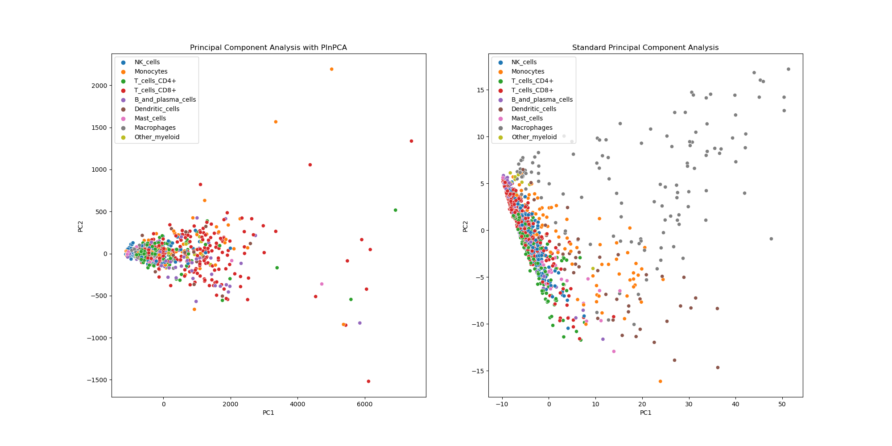
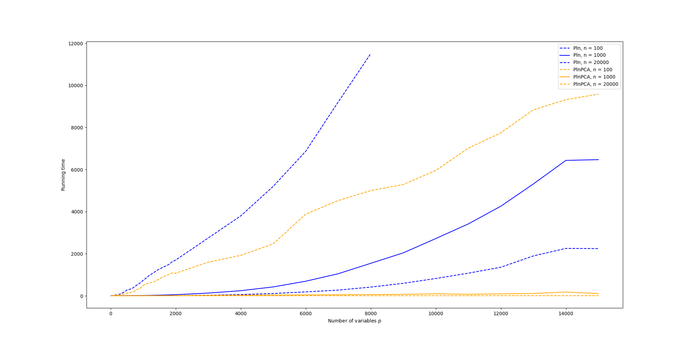

# Summary
High dimensional count data are hard to analyse as is, and normalization must
be performed but standard normalization does not fit to the characteristics of
count data. The Poisson LogNormal(PLN)  [@PLN] and PLN-PCA [@PLNPCA] are two-sided models allowing both suitable
normalization and analysis of multivariate count data. Each model is implemented in the `pyPLNmodels` package introduced here.
Possible fields of applications include
\begin{itemize}
\item Ecology: for $n$ sites and $p$ species, the counts represents the number of individuals of
  each species in each site. The PLN models aims to understand the correlation between
  species, specifically to establish potential dependencies, competitive
  interactions, and predatory dynamics. Additionally, the PLN models seek to
  explain the impact of covariates (when available), such as temperature, altitude, and other
  relevant factors, on the observed abundances.
\item Genomics: for $n$ cells and $p$ genes, the counts represents the number
  of times a gene is expressed in each cell. The objective is to estimate the
  correlation between genes and reduce the number of variables.
\end{itemize}
The models can deal with offsets when needed. The main functionalities of the `pyPLNmodels` package are
\begin{itemize}
\item Normalize count data to obtain more valuable data
\item Analyse the significance of each variable and their correlation
\item Perform regression when covariates are available
\item Reduce the number of variables with the PLN-PCA model
\item Visualize the normalized data
\end{itemize}
To illustrate the main model's interest, we display below a visualization of the first two principal components when Principal
Component Analysis (PCA) is performed with the PLN-PCA model(on the left) and standard PCA on
the log normalized data(on the right).  The data considered is the `scMARK` benchmark [@scMark] described in the
benchmark section. We kept 1000 samples for illustration purposes.

# Statement of need
While the R-package `PLNmodels` [@PLNmodels] implements PLN models, the python package
`pyPLNmodels` based on Pytorch [@Pytorch] has been built to handle
large datasets of count data, such as scRNA (single-cell Ribonucleic acid)
data. Real-world scRNA datasets typically involves thousands of cells ($n \approx 20000$) with
thousand of genes($p \approx 20000$), resulting in a matrix of size $\approx
20000 \times 20000$. The package has GPU support for a better scalability.

The `statsmodels` [@statsmodels] python package allows to deal with count data
thanks to the Generalized Linear Models `PoissonBayesMixedGLM` and
`BinomialBayesMixedGLM` classes. We stand out from this package by allowing covariance
between variables and performing Principal Component Analysis adequate to count data.

# Benchmark
We fit PLN and PLN-PCA models with the `pyPLNmodels` package on the `scMARK` dataset, a benchmark
for scRNA (sincle-cell Ribnonucleic acid ) data with
$n=19998$ samples (cells) and 14059 features (gene expression). We plot below the
running times required to fit such models when the number of variables (i.e.
genes) grows. We used 60 Principal Components when fitting the PLN-PCA model. A tolerance must be set as stopping criterion when fitting each model. The running
time required with the default tolerance is plot in solid line and a dotted line is plot with a relaxed tolerance. Note
that the default tolerance ensures the model parameters have reached
convergence but the relaxed one gives satisfying model parameters, while being
much faster.

# Acknowledgements
The authors would like to thank Jean-Benoist Léger for the time spent on giving
precious advices to build a proper python package. This work was
supported by the French ANR SingleStatOmics.
<!-- # Mathematics -->

<!-- Single dollars ($) are required for inline mathematics e.g. $f(x) = e^{\pi/x}$ -->

<!-- Double dollars make self-standing equations: -->

<!-- $$\Theta(x) = \left\{\begin{array}{l} -->
<!-- 0\textrm{ if } x < 0\cr -->
<!-- 1\textrm{ else} -->
<!-- \end{array}\right.$$ -->

<!-- You can also use plain \LaTeX for equations -->
<!-- \begin{equation}\label{eq:fourier} -->
<!-- \hat f(\omega) = \int_{-\infty}^{\infty} f(x) e^{i\omega x} dx -->
<!-- \end{equation} -->
<!-- and refer to \autoref{eq:fourier} from text. -->

<!-- # Citations -->

<!-- Citations to entries in paper.bib should be in -->
<!-- [rMarkdown](http://rmarkdown.rstudio.com/authoring_bibliographies_and_citations.html) -->
<!-- format. -->

<!-- If you want to cite a software repository URL (e.g. something on GitHub without a preferred -->
<!-- citation) then you can do it with the example BibTeX entry below for @fidgit. -->

<!-- For a quick reference, the following citation commands can be used: -->
<!-- - `@author:2001`  ->  "Author et al. (2001)" -->
<!-- - `[@author:2001]` -> "(Author et al., 2001)" -->
<!-- - `[@author1:2001; @author2:2001]` -> "(Author1 et al., 2001; Author2 et al., 2002)" -->

<!-- # Figures -->

<!-- Figures can be included like this: -->
<!--  -->
<!-- and referenced from text using \autoref{fig:example}. -->

<!-- Figure sizes can be customized by adding an optional second parameter: -->
<!-- { width=20% } -->

<!-- # Mathematical details -->
<!--  We introduce here the Poisson lognormal (PLN)  model PLNcite. Let $n,p,d,q \in \mathbb N_{\star}^4$. We consider: -->
<!-- \begin{itemize} -->
<!-- \item $n$ cells $(i=1,\ldots,n)$ -->

<!-- \item $p$ genes $(j=1,\ldots,p)$ -->

<!-- \item $n$ measures $X_{i}=\left(x_{i h}\right)_{1 \leq h \leq d}$ : -->
<!-- $X_{i h}=$ given descriptor (covariate) for cell $i$. -->

<!-- \item $n$  measures $Y_i = (Y_{i j})_{1\leq j \leq p}$ : $Y_{ij}$ corresponds to the number of times the gene $j$ is expressed in cell $i$. -->

<!-- \end{itemize} -->
<!-- We assume that for all ${1 \leq i \leq n}$, the observed abundances $\left(Y_{i -->
<!-- j}\right)_{1 \leq j \leq p}$ are independent conditionally on a latent variable -->
<!-- $Z_{i} \in \mathbb R^{p} $ such that: -->

<!-- \renewcommand{\arraystretch}{1.5}   % stretching -->
<!-- \begin{equation}\label{model} -->
<!-- \begin{array}{c} -->
<!-- W_{i}  \sim \mathcal{N}\left(0, I_{q}\right) \\ -->
<!-- Z_{i} = \beta^{\top}X_i + CW_i  \\ -->
<!--  \left(Y_{i j}  \mid Z_{i j} \right)  \sim \mathcal{P}\left(\exp \left(o_{i j} +Z_{i j}\right)\right) \\ -->
<!-- \end{array} -->
<!-- \end{equation} -->
<!-- \renewcommand{\arraystretch}{1} -->
<!-- where $O = (o_{ij})_{1\leq i\leq n, 1\leq j\leq p}$ are known offsets, $\beta = (\beta _{kj})_{1 \leq k \leq d, 1 \leq j \leq p}$ is an unknown regression parameter and $C \in \mathbb R ^ {p\times q}$ (unknown) sends the latent variable $W_i$ from a space of dimension $q$ to a space of dimension $p$. For $ i_0 \neq i_1 $, we assume $W_{i_0} \independent W_{i_1}$ so that   $ Y_{i_0} \independent Y_{i_1} $. We denote $ Y \in \mathbb R ^ {n\times p}$ (resp. $X\in \mathbb R ^ {n\times d},Z \in \mathbb R ^ {n\times p}$) the matrix obtained by stacking the $Y_i$'s (resp. $X_i, Z_i$) in line. -->

<!-- Note that mulitplying $C$ by an orthogonal matrix does not modify the model, so that $C$ is not identifiable. The unknown (and identifiable) parameter is $\theta = (\Sigma,\beta)$, where $\Sigma = CC^{\top}$ is the covariance matrix of each $Z_i$. The dimension $q\leq p$ is a hyperparameter that also needs to be tuned. We will consider two very different cases : -->
<!-- \begin{itemize} -->
<!-- \item p=q -->
<!-- \item q

<!-- \end{itemize} -->
# References
