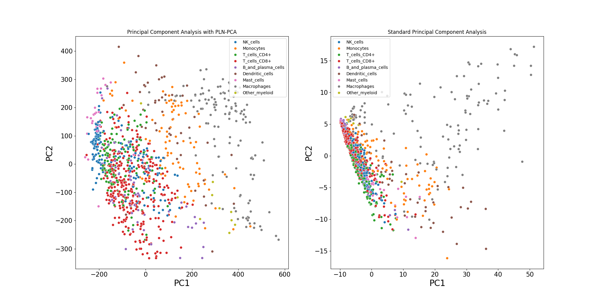

# Summary
High dimensional count data are hard to analyse as is, and normalization must
be performed but standard normalization does not fit to the characteristics of
count data. The Poisson LogNormal(PLN)  [@PLN] and its Principal Component
Analysis variant PLN-PCA [@PLNPCA] are two-sided latent variable models allowing both
suitable normalization and analysis of multivariate count data. The latent
variable is structured as a multivariate Gaussian variable, modelling complex
patterns and dependency structures. The PLN model is versatile and can be
extended beyond PCA to accommodate other multivariate statistical tasks, such as Clustering, Linear
Discriminant Analysis (LDA), and Network inference, described in [@PLNmodels].
Possible fields of applications include

\begin{itemize}
\item Ecology: Joint analysis of species abundances is a common task in
ecology, whose goal is to understand the interaction between species to
characterize a community, given a matrix of abundances in different sites with abundances given by
$$Y_{ij} = \text{number of species } j \text{ observed in site } i .$$
Specifically, it aims to establish potential dependencies, competitive interactions, and predatory dynamics.
Additionally, the PLN models seek to explain the impact of covariates (when available), such as temperature, altitude, and other
  relevant factors, on the observed abundances.
\item Genomics: High
throughput sequencing technologies now allow to quantify at the level of
individual cells various measures from the genome (DNA, Ribonucleic Acid(RNA),
chromatin and proteins) of humans, animals and plants. Single-cell RNA
sequencing (scRNA-seq) is one of those and measure the expression of genes at the level of individual cells. For
cell $i$ and gene $j$, the counts $Y_{ij}$ is given by
$$Y_{ij} = \text{number of times gene } j \text{ is expressed in cell } i.$$
One of the challenges with scRNA-seq data is managing the high
dimensionality, necessitating dimension reduction techniques adequate to count data.
\end{itemize}
The PLN and PLN-PCA variants are implemented in the ```pyPLNmodels``` package
introduced here whose main functionalities are
\begin{itemize}
\item Normalize count data to obtain more valuable data
\item Analyse the significance of each variable and their correlation
\item Perform regression when covariates are available
\item Reduce the number of features with PLN-PCA
\end{itemize}
The ```pyPLNmodels```[^pyplnmodels]  package has been designed to efficiently process
extensive datasets in a reasonable time and incorporates GPU
acceleration for a better scalability.


[^pyplnmodels]: https://github.com/PLN-team/pyPLNmodels
[^plnmodels]: https://github.com/PLN-team/PLNmodels


To illustrate the main model's interest, we display below a visualization of the first two principal components when Principal
Component Analysis (PCA) is performed with the PLN-PCA model (left) and standard PCA on
the log normalized data (right). The data considered is the `scMARK` benchmark [@scMark] described in the
benchmark section. We kept 1000 samples for illustration
purposes. The computational time for fitting PLN-PCA is 23 seconds (on GPU), whereas
standard PCA requires 0.7 second.



# Statement of need
While the R-package ```PLNmodels``` [@PLNmodels] implements PLN models (including some variants), the python package
```pyPLNmodels``` based on Pytorch [@Pytorch] has been built to handle
large datasets of count data, such as scRNA-seq data. Real-world scRNA-seq datasets typically involves thousands of cells ($n \approx 20000$) with
thousands of genes ($\approx 20000$), resulting in a matrix of size $\approx
20000 \times 20000$.

The `statsmodels` [@statsmodels] python package allows to deal with count data
thanks to the Generalized Linear Models `PoissonBayesMixedGLM` and
`BinomialBayesMixedGLM` classes. We stand out from this package by allowing covariance
between features and performing Principal Component Analysis adequate to count data.

The `GLLVM` package [@GLLVM] offers a broader scope of modeling
capabilities, enabling the incorporation of not
only Poisson distribution but also Binomial or Negative Binomial distributions,
along with an additional zero-inflation component. However, its scalability is
notably inferior to our proposed methodology. Our approach, specifically
the PLN-PCA model, demonstrates superior scalability, effectively
accommodating datasets with tens of thousands of variables, while the PLN model
handles thousands of variables within a reasonable computational timeframe. In
contrast, ```GLLVM``` struggles to scale beyond a few hundred variables within
practical computational limits.


# Benchmark
We compare
\begin{itemize}
\item PLN and PLN-PCA variants fitted with  \verb|pyPLNmodels| on CPU and GPU
\item PLN and PLN-PCA variants fitted with  \verb|PLNmodels| (on CPU)
\item \verb|GLLVM| (on CPU)
\end{itemize}
on the `scMARK` dataset, a benchmark for scRNA data, with
$n=19998$ cells (samples) and 14059 genes (variables) are available.
We plot below the running times required to fit such models when the number of variables (i.e.
genes) grows when $n = 100,1000, 19998$. We used $q =5$ Principal Components when fitting each
PLN-PCA model and the number of latent variables LV=$2$ for the ```GLLVM``` model.
For each model, the fitting process was halted if the running time exceeded
10,000 seconds. We were unable to run ```GLLVM``` for $n = 19998$ due to CPU memory
limitations (64 GB RAM). Similarly, ```py-PLN-PCA-GPU``` could not be run when
$n=19998$ and $p\geq13000$ as it exceeded the GPU memory capacity (24 GB RAM).


Each package uses variational inference, maximizing an Evidence
Lower BOund(ELBO) approximating the log-likelihood of the model.
```GLLVM``` uses an alternate-optimization scheme, fitting alternatively a Negative Binomial (NB) Generalized Linear
Model(GLM), and two penalized NB GLM coupled with a fixed-point algorithm, while ```pyPLNmodels``` and
```PLNmodels``` uses vanilla gradient ascent to maximize the ELBO.
```PLNmodels``` uses C++ backend along with ```nlopt```[@nlopt] optimization library.
The backend of ```GLLVM``` is implemented in C++, while ```pyPLNmodels``` leverages the
automatic differentiation from Pytorch to compute the gradients of the ELBO. Each
PLN-PCA model is estimated using comparable variational inference methods.
However, the variational approximation for the PLN model in the
```pyPLNmodels``` version is more efficient than its counterpart in
```PLNmodels```.

# Ongoing work
A zero-inflated version of the PLN model is currently under development, with a
preprint [@PLNzero] expected to be published in the near future.

# Acknowledgements
The authors would like to thank Jean-Benoist Léger for the time spent on giving
precious advices to build a proper python package.

# Fundings
Bastien Bartardière and Julien Chiquet are supported by
the French ANR grant ANR-18-CE45-0023 Statistics and Machine Learning for Single Cell Genomics (SingleStatOmics).

# References
